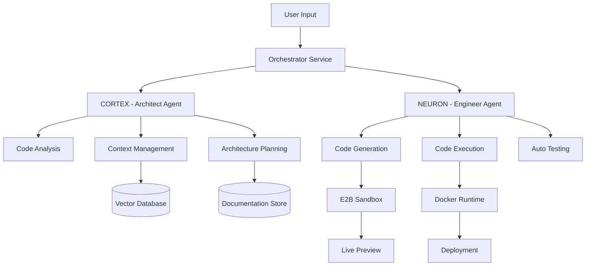

# 📊 ANALYSE DE FAISABILITÉ - ARCADIS SYNAPSE™ IDE

## 📋 Executive Summary

**Objectif** : Créer un IDE cloud concurrent direct de Cursor, Lovable, Replit et Vercel v0  
**Vision** : Un IDE avec architecture dual-agent unique (Architecte + Ingénieur) pour révolutionner le développement assisté par IA  
**Statut actuel** : Prototype basé sur Open Lovable avec modifications superficielles  

---

## 1. 🔍 ÉTAT ACTUEL DU PROJET

### 1.1 Base Open Lovable - Ce qui fonctionne

#### ✅ **Fonctionnalités existantes**
- **Sandbox E2B** : Exécution de code isolée fonctionnelle
- **Génération de code IA** : Intégration avec Claude, GPT, Groq
- **Scraping web** : Firecrawl API pour cloner des sites
- **Preview live** : iframe avec hot reload
- **Parsing de code** : Extraction de fichiers depuis réponses IA
- **Installation de packages** : npm/yarn automatique
- **Streaming de réponses** : SSE pour feedback temps réel

#### ⚠️ **Limitations critiques**
- **Pas d'éditeur de code** réel (juste preview)
- **Pas de système de fichiers** persistant
- **Pas de gestion de projet** multi-fichiers
- **Architecture monolithique** (tout dans des routes API)
- **UI basique** non optimisée pour production
- **Pas de collaboration** temps réel
- **Pas de versioning** du code
- **Sécurité minimale** (clés API exposées)

### 1.2 Modifications Arcadis - État actuel

#### ✅ **Ajouts réalisés**
- Configuration multi-modèles (20+ LLMs)
- Types TypeScript pour dual-agent
- Routes API pour Cortex/Neuron (mockées)
- UI moderne avec thème Arcadis
- Branding et assets personnalisés

#### ❌ **Non fonctionnel**
- Architecture dual-agent (mock uniquement)
- Orchestration réelle des agents
- Persistence de la documentation architecturale
- Métriques et analytics
- Système de fichiers intégré

---

## 2. 🎯 ANALYSE CONCURRENTIELLE

### 2.1 Benchmark des Leaders

| Critère               | **Cursor** | **Replit** | **Lovable** | **Vercel v0** | **Nous (Cible)** |
|---------              |------------|------------|-------------|---------------|------------------|
| **Éditeur de code**   | VSCode fork | Monaco custom | ❌ | ❌ | Monaco/CodeMirror |
| **Exécution**         | Local | Cloud containers | E2B | Edge Functions | E2B + Docker |
| **Collaboration**     | ❌ | ✅ Multiplayer | ❌ | ❌ | ✅ À implémenter |
| **IA intégrée**       | GPT-4 | Multiple | Claude | GPT-4 | **Dual-agent** |
| **Persistance**       | Local | Cloud DB | Session only | Vercel KV | PostgreSQL + S3 |
| **Déploiement**       | ❌ | ✅ | ❌ | ✅ Vercel | ✅ Multi-cloud |
| **Prix**              | $20/mois | $7-25/mois | Gratuit (beta) | $20/mois | $15-30/mois |
| **USP**               | IDE local IA | Multiplayer | Simple | UI generation | **Architecture IA** |

### 2.2 Forces à répliquer

#### **Cursor**
- Intégration native avec codebase local
- Context awareness excellent
- Cmd+K pour édition inline

#### **Replit**
- Environnement cloud complet
- Démarrage instantané
- Templates riches

#### **Lovable**
- Simplicité d'utilisation
- Génération from scratch
- Preview instantanée

#### **Vercel v0**
- UI/UX exceptionnelle
- Génération de composants
- Intégration Vercel

---

## 3. 🏗️ ARCHITECTURE TECHNIQUE REQUISE

### 3.1 Stack Technologique Cible

```yaml
Frontend:
  Framework: Next.js 14+ (App Router)
  UI Library: Radix UI + Tailwind CSS
  Editor: Monaco Editor ou CodeMirror 6
  State: Zustand + React Query
  Realtime: Socket.io ou Pusher
  
Backend:
  Runtime: Node.js + Bun
  API: tRPC ou GraphQL
  Database: PostgreSQL (Supabase)
  Cache: Redis (Upstash)
  Files: S3 (Cloudflare R2)
  
Infrastructure:
  Execution: E2B + Docker Swarm
  CDN: Cloudflare
  Monitoring: Sentry + Posthog
  CI/CD: GitHub Actions
  
AI Layer:
  Orchestration: LangChain/LangGraph
  Embeddings: Pinecone/Weaviate
  Models: Multi-provider (Anthropic, OpenAI, etc.)
```

### 3.2 Architecture Dual-Agent Détaillée



### 3.3 Composants Critiques à Développer

#### **1. Éditeur de Code Professionnel**
- Monaco Editor avec LSP support
- Syntax highlighting multi-langages
- Autocomplétion intelligente
- Multi-curseurs et collaboration
- Git diff visualization

#### **2. Système de Fichiers Cloud**
- Virtual File System (VFS)
- Sync bidirectionnel avec S3
- Conflict resolution
- Version control intégré
- Search & replace global

#### **3. Environnement d'Exécution**
- Containers Docker personnalisés
- Support multi-langages (JS, Python, Go, Rust)
- Package management automatique
- Environment variables sécurisées
- Logs et debugging

#### **4. Orchestration IA**
- Queue de tâches (BullMQ)
- State machine pour workflows
- Retry logic et fallbacks
- Cost tracking par utilisateur
- Rate limiting intelligent

---

## 4. 🎨 DESIGN SYSTEM SILICON VALLEY

### 4.1 Principes de Design

```typescript
const designPrinciples = {
  // 1. Clarté avant tout
  clarity: {
    hierarchy: "Clear visual hierarchy",
    spacing: "Generous whitespace",
    typography: "Readable at all sizes"
  },
  
  // 2. Performance perçue
  performance: {
    skeleton: "Loading states everywhere",
    optimistic: "Optimistic updates",
    progressive: "Progressive enhancement"
  },
  
  // 3. Delight utilisateur
  delight: {
    microInteractions: "Subtle animations",
    feedback: "Instant visual feedback",
    personality: "Brand voice consistent"
  },
  
  // 4. Accessibilité
  accessibility: {
    wcag: "WCAG 2.1 AA minimum",
    keyboard: "Full keyboard navigation",
    screenReader: "Screen reader optimized"
  }
};
```

### 4.2 Composants UI Essentiels

| Composant | Inspiration | Implementation |
|-----------|------------|----------------|
| **Command Palette** | Raycast/Linear | Cmd+K universal search |
| **Editor Tabs** | VSCode | Draggable, closeable, pinnable |
| **File Tree** | GitHub | Collapsible, searchable |
| **Terminal** | Warp | AI-powered suggestions |
| **Chat Interface** | ChatGPT | Streaming, markdown, code blocks |
| **Settings** | Notion | Nested, searchable |
| **Notifications** | Slack | Non-blocking, actionable |

### 4.3 Palette de Couleurs Production

```scss
// Light Theme
$light: (
  bg-primary: #FFFFFF,
  bg-secondary: #F7F8FA,
  bg-tertiary: #EFF1F5,
  text-primary: #0A0D14,
  text-secondary: #4B5563,
  accent-primary: #0054A6,  // Arcadis Blue
  accent-success: #10B981,
  accent-warning: #F59E0B,
  accent-error: #EF4444
);

// Dark Theme
$dark: (
  bg-primary: #0A0D14,
  bg-secondary: #141823,
  bg-tertiary: #1E2433,
  text-primary: #F9FAFB,
  text-secondary: #9CA3AF,
  accent-primary: #3B82F6,
  accent-success: #34D399,
  accent-warning: #FBBF24,
  accent-error: #F87171
);
```

---

## 5. 💰 ANALYSE ÉCONOMIQUE

### 5.1 Coûts de Développement

| Phase | Durée | Ressources | Coût estimé |
|-------|-------|------------|-------------|
| **MVP** | 3 mois | 3 devs + 1 designer | 150k€ |
| **Beta** | 3 mois | 5 devs + 2 designers | 250k€ |
| **v1.0** | 6 mois | 8 devs + 3 designers | 500k€ |
| **Total Year 1** | 12 mois | - | **900k€** |

### 5.2 Coûts Opérationnels (par mois)

```yaml
Infrastructure:
  AWS/GCP: 5,000€
  Vercel: 500€
  Databases: 1,000€
  CDN: 500€
  
APIs:
  OpenAI: 10,000€
  Anthropic: 8,000€
  Others: 2,000€
  
Tools:
  Monitoring: 500€
  Analytics: 300€
  Support: 200€
  
Total: ~28,000€/mois
```

### 5.3 Modèle de Revenus

| Tier | Prix/mois | Features | Target |
|------|-----------|----------|--------|
| **Free** | 0€ | 10 projects, GPT-3.5 | Hobbyists |
| **Pro** | 19€ | Unlimited, GPT-4 | Developers |
| **Team** | 49€/user | Collaboration, Priority | Startups |
| **Enterprise** | Custom | SSO, SLA, Support | Corporates |

**Break-even**: ~1,500 utilisateurs payants

---

## 6. 🚀 ROADMAP RÉALISTE

### Phase 1: Foundation (3 mois)
- [ ] Réécriture complète du frontend
- [ ] Monaco Editor integration
- [ ] Système de fichiers cloud
- [ ] Authentication (Clerk/Auth0)
- [ ] Basic dual-agent implementation

### Phase 2: Core Features (3 mois)
- [ ] Real dual-agent orchestration
- [ ] Multi-language support
- [ ] Git integration
- [ ] Deployment pipelines
- [ ] Team collaboration

### Phase 3: Scale (6 mois)
- [ ] Enterprise features
- [ ] Marketplace/Templates
- [ ] API publique
- [ ] Mobile app
- [ ] Self-hosted version

---

## 7. 🔴 RISQUES ET MITIGATION

### Risques Techniques
| Risque | Probabilité | Impact | Mitigation |
|--------|-------------|--------|------------|
| Latence IA élevée | Haute | Élevé | Multi-provider, cache agressif |
| Coûts API explosifs | Moyenne | Élevé | Rate limiting, modèles propriétaires |
| Sécurité sandboxes | Faible | Critique | Audits réguliers, isolation renforcée |
| Scalabilité | Moyenne | Élevé | Architecture microservices |

### Risques Business
- **Compétition féroce** : Cursor lève 60M$, Replit 100M$
- **Dépendance API** : OpenAI/Anthropic peuvent changer leurs prix
- **Adoption lente** : Développeurs attachés à leurs outils
- **Burn rate élevé** : 28k€/mois minimum en ops

---

## 8. ✅ RECOMMANDATIONS

### Décision GO/NO-GO

**🟡 GO CONDITIONNEL**

### Conditions de succès
1. **Lever 2-3M€** minimum en seed
2. **Recruter CTO senior** ex-FAANG
3. **Partenariat stratégique** avec cloud provider
4. **Différenciation claire** sur dual-agent
5. **MVP en 3 mois** maximum

### Actions Immédiates

```bash
# Semaine 1-2
- Valider le concept avec 50 développeurs
- Prototype Monaco + dual-agent
- Estimer coûts réels API

# Semaine 3-4  
- Recruter lead engineer
- Définir architecture finale
- Créer pitch deck investisseurs

# Mois 2
- Développer MVP focalisé
- Onboarder 10 beta testers
- Itérer sur feedback

# Mois 3
- Lancer beta publique
- Mesurer métriques clés
- Décider pivot ou scale
```

### Alternative pragmatique

Si les ressources sont limitées, considérer :
1. **Plugin VSCode** avec dual-agent (plus simple)
2. **API as a Service** pour autres IDEs
3. **Focus B2B** entreprises uniquement
4. **Acquisition** par player existant

---

## 📎 CONCLUSION

Le projet est **techniquement faisable** mais nécessite des **ressources significatives** pour rivaliser. La différenciation par l'architecture dual-agent est **innovante** mais doit prouver sa **valeur ajoutée réelle**.

**Recommandation finale** : Développer un **MVP ultra-focalisé** sur le dual-agent, tester avec une **communauté restreinte**, puis décider de **pivoter ou scaler** basé sur les métriques d'adoption.

> "The best way to predict the future is to invent it." - Alan Kay

---

*Document préparé pour Arcadis Tech - Confidentiel*