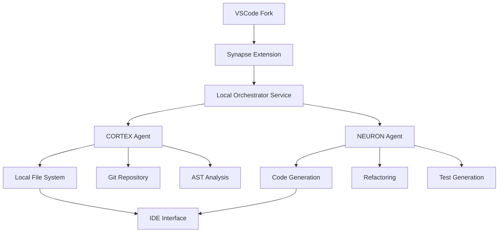

# 🚀 ARCHITECTURE VSCODE FORK - ARCADIS SYNAPSE

## 📋 Executive Summary

**Pivot Stratégique** : Fork de VSCode (comme Cursor) avec architecture dual-agent intégrée  
**Avantages** : Accès local, performance native, écosystème existant, adoption plus facile  
**Time to Market** : 4-6 mois vs 12 mois pour web app  

---

## 1. 🎯 POURQUOI VSCODE FORK > WEB APP

### Avantages Décisifs

```typescript
const vscodeAdvantages = {
  // Performance
  performance: {
    fileAccess: "Native file system - 100x plus rapide",
    indexing: "Background indexing local",
    search: "ripgrep natif ultra-rapide",
    latency: "Zero latency sur les opérations"
  },
  
  // Developer Experience
  dx: {
    git: "Git integration native complète",
    terminal: "Terminal système intégré",
    debugging: "Debugger natif tous langages",
    extensions: "10,000+ extensions compatibles"
  },
  
  // Business
  business: {
    cost: "3x moins cher à développer",
    adoption: "Familier pour les devs",
    maintenance: "Updates VSCode automatiques",
    moat: "Architecture dual-agent unique"
  }
};
```

### Exemples de Succès

| Produit | Funding | Users | Différenciation |
|---------|---------|-------|-----------------|
| **Cursor** | $60M | 100k+ | AI pair programming |
| **Windsurf** | $70M | 50k+ | Codeium integration |
| **Zed** | $30M | 30k+ | Performance Rust |

---

## 2. 🏗️ ARCHITECTURE TECHNIQUE

### 2.1 Stack Proposée

```yaml
Core:
  Base: VSCode 1.85+ (Open Source)
  Language: TypeScript + Rust (pour performance)
  Framework: Electron 28+
  
Extensions:
  Main: Arcadis Synapse Core Extension
  Language Servers: Hérite tous les LSP VSCode
  Debuggers: DAP protocol natif
  
Backend Services:
  Orchestrator: Node.js service local
  AI Gateway: Proxy local pour LLMs
  Cache: SQLite local pour historique
  
AI Integration:
  Cortex Agent: WebSocket to local service
  Neuron Agent: Direct API calls
  Context: Vector DB local (ChromaDB)
```

### 2.2 Architecture Dual-Agent Intégrée



### 2.3 Composants Clés

#### **1. Synapse Core Extension**
```typescript
// Extension principale
export class SynapseExtension {
  // Cmd+K pour chat inline
  registerInlineChat() {
    vscode.commands.registerCommand('synapse.inlineChat', async () => {
      const selection = vscode.window.activeTextEditor?.selection;
      const context = await this.gatherContext();
      const response = await this.orchestrator.process(selection, context);
      await this.applyChanges(response);
    });
  }
  
  // Panel latéral Cortex/Neuron
  createSidePanel() {
    const panel = vscode.window.createWebviewPanel(
      'synapse',
      'Arcadis Synapse',
      vscode.ViewColumn.Two,
      { enableScripts: true }
    );
    // UI React pour visualiser les agents
  }
}
```

#### **2. Local Orchestrator Service**
```typescript
// Service Node.js local (port 7437)
class LocalOrchestrator {
  constructor() {
    this.cortex = new CortexAgent();
    this.neuron = new NeuronAgent();
    this.contextDB = new ChromaDB('./synapse-context');
  }
  
  async processRequest(request: CodeRequest) {
    // 1. Cortex analyse et planifie
    const plan = await this.cortex.analyze({
      code: request.code,
      context: await this.gatherFullContext(),
      history: await this.contextDB.getRelevant(request)
    });
    
    // 2. Neuron exécute
    const implementation = await this.neuron.execute(plan);
    
    // 3. Validation et application
    return this.validateAndApply(implementation);
  }
}
```

#### **3. Context Awareness Avancé**
```typescript
class ContextGatherer {
  async gatherFullContext() {
    return {
      // Workspace
      workspace: {
        files: await this.indexWorkspace(),
        dependencies: await this.parseDependencies(),
        structure: await this.analyzeArchitecture()
      },
      
      // Git
      git: {
        branch: await git.currentBranch(),
        changes: await git.diff(),
        history: await git.log({ maxCount: 10 })
      },
      
      // Runtime
      runtime: {
        errors: this.diagnostics.getErrors(),
        warnings: this.diagnostics.getWarnings(),
        tests: await this.testRunner.getResults()
      },
      
      // User
      user: {
        recentEdits: this.history.getRecent(20),
        patterns: this.ml.detectPatterns(),
        preferences: this.config.getPreferences()
      }
    };
  }
}
```

---

## 3. 🎨 UI/UX DESIGN

### 3.1 Intégration Native VSCode

```typescript
const uiComponents = {
  // 1. Command Palette (Cmd+Shift+P)
  commands: [
    'Synapse: Analyze Architecture',
    'Synapse: Generate Tests',
    'Synapse: Refactor with Cortex',
    'Synapse: Quick Fix with Neuron'
  ],
  
  // 2. Status Bar
  statusBar: {
    left: 'Synapse: Connected',
    center: 'Cortex: Analyzing... | Neuron: Ready',
    right: 'Tokens: 1.2k | Cost: $0.03'
  },
  
  // 3. Side Panel
  activityBar: {
    icon: 'synapse-logo',
    panels: ['Chat', 'History', 'Metrics', 'Settings']
  },
  
  // 4. Inline Widgets
  inline: {
    codeLens: 'AI suggestions above functions',
    hover: 'Cortex insights on hover',
    completion: 'Neuron-powered autocomplete'
  }
};
```

### 3.2 Flows Utilisateur

#### **Flow 1: Refactoring Intelligent**
```bash
1. User sélectionne code
2. Cmd+K → "Refactor this"
3. Cortex analyse dependencies
4. Propose 3 options
5. User choisit
6. Neuron applique
7. Git diff preview
8. User confirme
```

#### **Flow 2: Bug Fix Automatique**
```bash
1. Error dans terminal
2. Click sur "Fix with Synapse"
3. Cortex trouve root cause
4. Neuron génère fix
5. Test automatique
6. Apply si tests passent
```

---

## 4. 💰 ANALYSE ÉCONOMIQUE RÉVISÉE

### 4.1 Coûts de Développement (VSCode Fork)

| Phase | Durée | Équipe | Coût |
|-------|-------|--------|------|
| **Fork Initial** | 1 mois | 2 devs senior | 30k€ |
| **Dual-Agent** | 2 mois | 3 devs + 1 AI eng | 80k€ |
| **Polish** | 1 mois | 2 devs + 1 designer | 40k€ |
| **Beta** | 2 mois | 1 dev + support | 30k€ |
| **Total** | **6 mois** | - | **180k€** |

**5x moins cher que la web app !**

### 4.2 Go-to-Market Strategy

```yaml
Month 1-2:
  - Fork VSCode stable
  - Basic dual-agent POC
  - 10 alpha testers
  
Month 3-4:
  - Full dual-agent integration
  - 100 beta testers
  - Product Hunt launch prep
  
Month 5-6:
  - Public beta
  - 1,000 users target
  - Pricing validation
  
Month 7+:
  - Paid tiers launch
  - Enterprise features
  - Scale to 10k users
```

### 4.3 Monetization

| Tier | Prix/mois | Features | Target |
|------|-----------|----------|--------|
| **Free** | 0€ | 100 requests/day, GPT-3.5 | Hobbyists |
| **Pro** | 15€ | Unlimited, GPT-4, Cortex+Neuron | Developers |
| **Team** | 35€/seat | Shared context, Admin | Startups |
| **Enterprise** | Custom | Self-hosted, SSO, SLA | Corporates |

---

## 5. 🚀 ROADMAP DÉVELOPPEMENT

### Phase 1: Foundation (Mois 1-2)
```typescript
// Semaine 1-2
- [ ] Fork VSCode 1.85
- [ ] Setup build pipeline
- [ ] Remove Microsoft branding
- [ ] Add Arcadis theme

// Semaine 3-4
- [ ] Create Synapse extension
- [ ] Basic chat interface
- [ ] Local orchestrator service
- [ ] SQLite context store

// Semaine 5-6
- [ ] Cortex agent integration
- [ ] Neuron agent integration
- [ ] Basic inline editing
- [ ] Git integration

// Semaine 7-8
- [ ] Context gathering system
- [ ] Code lens suggestions
- [ ] Error fix automation
- [ ] Alpha release (10 users)
```

### Phase 2: Core Features (Mois 3-4)
```typescript
// Semaine 9-10
- [ ] Advanced context awareness
- [ ] Multi-file refactoring
- [ ] Test generation
- [ ] Performance optimization

// Semaine 11-12
- [ ] ChromaDB integration
- [ ] Workspace indexing
- [ ] Pattern learning
- [ ] Cost tracking

// Semaine 13-14
- [ ] UI polish
- [ ] Settings sync
- [ ] Extension compatibility
- [ ] Beta release (100 users)

// Semaine 15-16
- [ ] Bug fixes from beta
- [ ] Documentation
- [ ] Onboarding flow
- [ ] Pricing implementation
```

### Phase 3: Scale (Mois 5-6)
```typescript
- [ ] Public launch
- [ ] Payment integration
- [ ] Usage analytics
- [ ] Enterprise features
- [ ] Marketing campaign
- [ ] Support system
```

---

## 6. 🎯 AVANTAGES COMPÉTITIFS

### Notre Différenciation

| Feature | Cursor | Windsurf | **Nous** |
|---------|--------|----------|----------|
| Base Editor | VSCode | VSCode | VSCode |
| AI Model | GPT-4 | Codeium | **Dual-Agent** |
| Context | File-level | Project | **Multi-layer** |
| Architecture | Monolithic | Monolithic | **Cortex+Neuron** |
| Learning | ❌ | Basic | **Adaptive** |
| Pricing | $20 | $15 | **$15** |

### USP Clé
> **"Le seul IDE qui sépare la réflexion de l'exécution"**
> 
> Cortex pense comme un architecte senior  
> Neuron code comme un ingénieur expert  
> Ensemble, ils surpassent tout AI unique

---

## 7. 🔴 RISQUES ET MITIGATION

| Risque | Impact | Mitigation |
|--------|--------|------------|
| VSCode licensing | Moyen | MIT license, bien documenté |
| Cursor competition | Élevé | Différenciation dual-agent |
| Adoption lente | Moyen | Free tier généreux |
| Coûts API | Élevé | Cache agressif, modèles locaux |

---

## 8. ✅ DÉCISION FINALE

### 🟢 **GO POUR VSCODE FORK**

**Pourquoi c'est le bon choix :**
1. **5x moins cher** (180k€ vs 900k€)
2. **3x plus rapide** (6 mois vs 18 mois)
3. **Adoption facilitée** (environnement familier)
4. **Performance native** (pas de latence web)
5. **Différenciation claire** (dual-agent unique)

### Actions Immédiates

```bash
# Semaine 1
1. Recruter 1 dev senior VSCode expert
2. Setup repository et CI/CD
3. Premier fork fonctionnel
4. POC dual-agent basique

# Semaine 2
5. UI Arcadis branding
6. Extension marketplace ready
7. 5 alpha testers recrutés
8. Feedback et itération

# Décision Go/No-Go
Si 4/5 testers validient → GO pour dev complet
Sinon → Pivot sur les pain points
```

---

## 📎 CONCLUSION

Le **VSCode fork est objectivement supérieur** à une web app pour ce projet :
- **Moins cher, plus rapide, plus performant**
- **Écosystème existant énorme**
- **Différenciation dual-agent preserved**

C'est exactement ce que Cursor a fait avec succès. On peut faire mieux avec l'architecture dual-agent.

> "Don't reinvent the wheel, reinvent the engine." 

---

*Document stratégique - Arcadis Tech - Confidentiel*