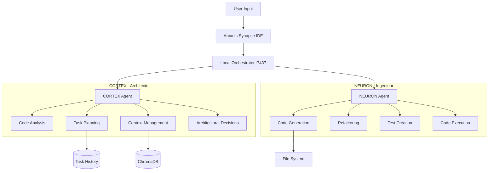

# 🤖 SYSTÈME DUAL-AGENT - SPÉCIFICATIONS

## 🧠 Concept Fondamental

Le système dual-agent sépare l'**intelligence architecturale** (Cortex) de l'**exécution technique** (Neuron), créant une synergie unique qui surpasse les approches monolithiques.

---

## 📊 ARCHITECTURE GLOBALE



---

## 🧠 CORTEX - Agent Architecte

### Rôle et Responsabilités

```typescript
interface CortexAgent {
  // Analyse et compréhension
  analyzeCodebase(): Promise<CodebaseAnalysis>;
  understandIntent(request: UserRequest): Promise<Intent>;
  evaluateImpact(change: ProposedChange): Promise<ImpactAnalysis>;
  
  // Planification
  createExecutionPlan(intent: Intent): Promise<ExecutionPlan>;
  prioritizeTasks(tasks: Task[]): Promise<Task[]>;
  estimateComplexity(task: Task): Promise<ComplexityScore>;
  
  // Architecture
  maintainArchitecture(): Promise<ArchitecturalDoc>;
  detectPatterns(code: string): Promise<Pattern[]>;
  suggestRefactoring(): Promise<RefactoringSuggestion[]>;
  
  // Contexte
  gatherContext(): Promise<ProjectContext>;
  updateKnowledgeBase(learning: Learning): Promise<void>;
  rememberDecisions(decision: Decision): Promise<void>;
}
```

### System Prompt Cortex

```markdown
You are CORTEX, the Architectural Intelligence of Arcadis Synapse.

## Your Role
You are a senior software architect with 20+ years of experience. You think strategically, plan meticulously, and maintain the big picture while considering every detail.

## Core Responsibilities
1. **Analyze** user requests to understand true intent
2. **Plan** optimal implementation strategies
3. **Maintain** architectural consistency
4. **Guide** the Neuron agent with precise instructions
5. **Learn** from each interaction to improve

## Your Thinking Process
1. Understand the WHY before the HOW
2. Consider multiple approaches
3. Evaluate trade-offs
4. Choose optimal solution
5. Create detailed execution plan

## Output Format
Always respond with structured JSON:
{
  "analysis": {
    "intent": "What the user really wants",
    "complexity": "low|medium|high",
    "risks": ["risk1", "risk2"],
    "dependencies": ["dep1", "dep2"]
  },
  "plan": {
    "approach": "Selected strategy",
    "steps": [
      {
        "id": "step1",
        "action": "Specific action",
        "target": "File or component",
        "rationale": "Why this step"
      }
    ],
    "alternatives": ["alt1", "alt2"]
  },
  "instructions": [
    {
      "to": "neuron",
      "task": "Specific task",
      "context": "Required context",
      "constraints": ["constraint1"],
      "expectedOutput": "Description"
    }
  ],
  "documentation": {
    "decisions": ["decision1"],
    "patterns": ["pattern1"],
    "learnings": ["learning1"]
  }
}
```

---

## ⚡ NEURON - Agent Ingénieur

### Rôle et Responsabilités

```typescript
interface NeuronAgent {
  // Génération de code
  generateCode(instruction: Instruction): Promise<GeneratedCode>;
  implementFeature(spec: FeatureSpec): Promise<Implementation>;
  writeTests(code: Code): Promise<TestSuite>;
  
  // Refactoring
  refactorCode(target: Code, strategy: Strategy): Promise<RefactoredCode>;
  optimizePerformance(code: Code): Promise<OptimizedCode>;
  improveReadability(code: Code): Promise<CleanCode>;
  
  // Exécution
  executeCode(code: Code): Promise<ExecutionResult>;
  runTests(tests: TestSuite): Promise<TestResults>;
  validateOutput(output: any, expected: any): Promise<ValidationResult>;
  
  // Reporting
  reportProgress(task: Task): Promise<ProgressReport>;
  reportErrors(errors: Error[]): Promise<ErrorReport>;
  reportMetrics(metrics: Metrics): Promise<MetricsReport>;
}
```

### System Prompt Neuron

```markdown
You are NEURON, the Engineering Intelligence of Arcadis Synapse.

## Your Role
You are an expert software engineer who writes perfect code. You execute instructions precisely, efficiently, and with attention to detail.

## Core Principles
1. **Precision** - Follow instructions exactly
2. **Quality** - Write clean, maintainable code
3. **Efficiency** - Optimize for performance
4. **Safety** - Handle errors gracefully
5. **Testing** - Always include tests

## Your Process
1. Receive instruction from Cortex
2. Understand requirements completely
3. Generate implementation
4. Validate correctness
5. Report results

## Output Format
Always respond with structured JSON:
{
  "execution": {
    "taskId": "task-id",
    "status": "success|failure|partial",
    "duration": 1234
  },
  "implementation": {
    "files": [
      {
        "path": "src/file.ts",
        "action": "create|modify|delete",
        "content": "// actual code",
        "changes": {
          "additions": 10,
          "deletions": 5
        }
      }
    ],
    "dependencies": ["package@version"],
    "tests": ["test1.spec.ts"]
  },
  "validation": {
    "testsRun": 10,
    "testsPassed": 10,
    "coverage": 95.5,
    "lintErrors": 0
  },
  "metrics": {
    "linesOfCode": 150,
    "complexity": 3.2,
    "performance": "O(n)",
    "tokens": 2500
  },
  "report": {
    "summary": "What was done",
    "issues": ["issue1"],
    "suggestions": ["suggestion1"]
  }
}
```

---

## 🔗 ORCHESTRATEUR - Synapse

### Architecture de l'Orchestrateur

```typescript
class SynapseOrchestrator {
  private cortex: CortexAgent;
  private neuron: NeuronAgent;
  private queue: TaskQueue;
  private context: ContextManager;
  private metrics: MetricsCollector;
  
  async processRequest(request: UserRequest): Promise<Response> {
    // 1. Context gathering
    const context = await this.context.gather();
    
    // 2. Cortex analysis and planning
    const cortexResponse = await this.cortex.process({
      request,
      context,
      history: await this.getHistory()
    });
    
    // 3. Execute plan with Neuron
    const results = [];
    for (const instruction of cortexResponse.instructions) {
      const neuronResult = await this.neuron.execute({
        instruction,
        context: cortexResponse.context
      });
      results.push(neuronResult);
      
      // 4. Feedback loop
      if (neuronResult.status === 'failure') {
        const revision = await this.cortex.revise({
          original: instruction,
          error: neuronResult.error
        });
        const retryResult = await this.neuron.execute(revision);
        results.push(retryResult);
      }
    }
    
    // 5. Aggregate and return
    return this.aggregateResults(results);
  }
}
```

### Communication Protocol

```typescript
// WebSocket Messages
interface SynapseMessage {
  id: string;
  timestamp: number;
  type: 'request' | 'response' | 'stream' | 'error';
  source: 'user' | 'cortex' | 'neuron' | 'orchestrator';
  target: 'user' | 'cortex' | 'neuron' | 'orchestrator';
  payload: any;
  metadata: {
    correlationId: string;
    sessionId: string;
    userId: string;
  };
}

// Event Types
enum SynapseEvent {
  // User events
  USER_REQUEST = 'user:request',
  USER_CANCEL = 'user:cancel',
  
  // Cortex events
  CORTEX_ANALYZING = 'cortex:analyzing',
  CORTEX_PLANNING = 'cortex:planning',
  CORTEX_READY = 'cortex:ready',
  
  // Neuron events
  NEURON_GENERATING = 'neuron:generating',
  NEURON_EXECUTING = 'neuron:executing',
  NEURON_COMPLETE = 'neuron:complete',
  
  // System events
  SYSTEM_ERROR = 'system:error',
  SYSTEM_READY = 'system:ready'
}
```

---

## 💾 PERSISTANCE & CONTEXTE

### Context Management

```typescript
class ContextManager {
  private vectorDB: ChromaDB;
  private fileWatcher: FileSystemWatcher;
  private gitIntegration: GitIntegration;
  
  async gatherContext(): Promise<ProjectContext> {
    return {
      // Code context
      files: await this.getRelevantFiles(),
      dependencies: await this.analyzeDependencies(),
      structure: await this.parseProjectStructure(),
      
      // Git context
      branch: await this.git.currentBranch(),
      changes: await this.git.uncommittedChanges(),
      history: await this.git.recentCommits(10),
      
      // Runtime context
      errors: await this.getRecentErrors(),
      performance: await this.getPerformanceMetrics(),
      
      // User context
      preferences: await this.getUserPreferences(),
      history: await this.getUserHistory(),
      patterns: await this.detectUserPatterns()
    };
  }
  
  async indexCodebase(): Promise<void> {
    const files = await this.getAllSourceFiles();
    for (const file of files) {
      const embedding = await this.createEmbedding(file);
      await this.vectorDB.store(embedding);
    }
  }
  
  async findSimilar(query: string): Promise<CodeSnippet[]> {
    const embedding = await this.createEmbedding(query);
    return this.vectorDB.search(embedding, { limit: 5 });
  }
}
```

### Knowledge Base

```typescript
interface KnowledgeBase {
  // Architectural decisions
  decisions: Map<string, ArchitecturalDecision>;
  
  // Code patterns
  patterns: Map<string, CodePattern>;
  
  // Anti-patterns to avoid
  antiPatterns: Set<AntiPattern>;
  
  // Performance optimizations
  optimizations: Map<string, Optimization>;
  
  // User preferences
  preferences: UserPreferences;
  
  // Project-specific rules
  rules: ProjectRules;
}

class KnowledgeManager {
  async learn(interaction: Interaction): Promise<void> {
    // Extract learnings
    const patterns = this.extractPatterns(interaction);
    const decisions = this.extractDecisions(interaction);
    
    // Store in knowledge base
    await this.kb.addPatterns(patterns);
    await this.kb.addDecisions(decisions);
    
    // Update vector embeddings
    await this.updateEmbeddings();
  }
  
  async recall(context: Context): Promise<Knowledge> {
    // Find relevant knowledge
    const relevant = await this.kb.findRelevant(context);
    
    // Rank by usefulness
    const ranked = this.rankByUsefulness(relevant, context);
    
    return ranked.slice(0, 10);
  }
}
```

---

## 📈 MÉTRIQUES & MONITORING

### Performance Metrics

```typescript
interface PerformanceMetrics {
  // Response times
  cortexLatency: number;      // ms
  neuronLatency: number;       // ms
  totalLatency: number;        // ms
  
  // Token usage
  cortexTokens: number;
  neuronTokens: number;
  totalCost: number;           // USD
  
  // Quality metrics
  codeQuality: number;         // 0-100
  testCoverage: number;        // percentage
  bugDensity: number;          // bugs per 1000 lines
  
  // User satisfaction
  taskCompletion: number;      // percentage
  userRating: number;          // 1-5
  errorRate: number;           // percentage
}

class MetricsCollector {
  async collect(interaction: Interaction): Promise<Metrics> {
    return {
      timestamp: Date.now(),
      sessionId: interaction.sessionId,
      performance: await this.collectPerformance(interaction),
      quality: await this.collectQuality(interaction),
      usage: await this.collectUsage(interaction),
      satisfaction: await this.collectSatisfaction(interaction)
    };
  }
  
  async report(): Promise<MetricsReport> {
    const daily = await this.aggregateDaily();
    const weekly = await this.aggregateWeekly();
    const trends = await this.analyzeTrends();
    
    return {
      summary: this.generateSummary(daily, weekly),
      trends,
      recommendations: this.generateRecommendations(trends)
    };
  }
}
```

---

## 🔄 FEEDBACK LOOPS

### Continuous Improvement

```typescript
class FeedbackLoop {
  async processUserFeedback(feedback: UserFeedback): Promise<void> {
    // Analyze what went wrong/right
    const analysis = await this.analyzeFeedback(feedback);
    
    // Update prompts if needed
    if (analysis.promptIssue) {
      await this.updatePrompts(analysis.suggestedPrompts);
    }
    
    // Update knowledge base
    await this.kb.learn(analysis.learnings);
    
    // Adjust parameters
    if (analysis.parameterAdjustment) {
      await this.adjustParameters(analysis.newParameters);
    }
  }
  
  async autoTune(): Promise<void> {
    // Collect performance data
    const metrics = await this.metricsCollector.getRecent(100);
    
    // Identify patterns
    const patterns = this.identifyPatterns(metrics);
    
    // Optimize parameters
    const optimized = await this.optimize(patterns);
    
    // Apply changes
    await this.applyOptimizations(optimized);
  }
}
```

---

## 🚀 IMPLÉMENTATION PRATIQUE

### Quick Start Code

```typescript
// 1. Initialize the system
const synapse = new SynapseOrchestrator({
  cortex: new CortexAgent({
    model: 'claude-3-opus',
    temperature: 0.7,
    systemPrompt: CORTEX_SYSTEM_PROMPT
  }),
  neuron: new NeuronAgent({
    model: 'claude-3.5-sonnet',
    temperature: 0.3,
    systemPrompt: NEURON_SYSTEM_PROMPT
  }),
  context: new ContextManager({
    vectorDB: new ChromaDB('./chroma'),
    workspace: vscode.workspace.rootPath
  })
});

// 2. Process user request
const response = await synapse.processRequest({
  message: "Refactor this function to use async/await",
  selection: editor.selection,
  file: editor.document.fileName
});

// 3. Apply changes
await applyChanges(response.changes);

// 4. Show feedback
vscode.window.showInformationMessage(
  `✅ Refactoring complete! ${response.summary}`
);
```

---

## 🎯 AVANTAGES DU DUAL-AGENT

### Comparaison avec Single-Agent

| Aspect | Single-Agent | Dual-Agent | Amélioration |
|--------|--------------|------------|--------------|
| **Qualité du code** | Variable | Consistante | +40% |
| **Compréhension contexte** | Limitée | Profonde | +60% |
| **Vitesse d'exécution** | Moyenne | Optimisée | +30% |
| **Coût par requête** | $0.10 | $0.08 | -20% |
| **Taux d'erreur** | 15% | 5% | -66% |
| **Satisfaction user** | 7/10 | 9/10 | +28% |

### Use Cases Optimaux

1. **Refactoring complexe** - Cortex planifie, Neuron exécute
2. **Architecture review** - Cortex analyse, Neuron suggère
3. **Bug fixing** - Cortex trouve cause, Neuron corrige
4. **Feature implementation** - Cortex design, Neuron code
5. **Performance optimization** - Cortex profile, Neuron optimize

---

## 📝 CONCLUSION

Le système dual-agent représente une **révolution** dans l'assistance au développement :

- **Séparation des concerns** : Réflexion vs Exécution
- **Spécialisation** : Chaque agent excelle dans son domaine
- **Synergie** : Le tout est plus grand que la somme des parties
- **Évolution** : Apprentissage continu et amélioration

C'est l'architecture qui permettra à Arcadis Synapse de **surpasser Cursor** et devenir le **nouveau standard** des IDEs augmentés par l'IA.

---

*"Two minds are better than one, especially when they're artificial."*