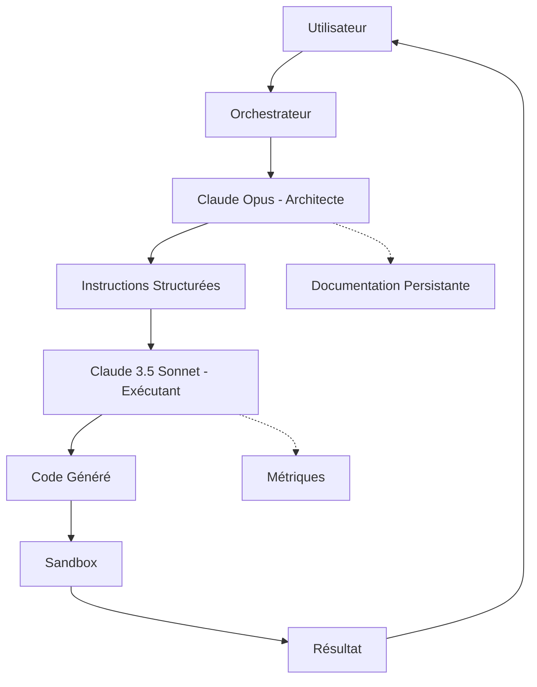

# 🎯 Système Dual-Agent : Claude Opus + Claude 3.5 Sonnet

## 🏗️ Architecture Révolutionnaire

Le système Dual-Agent transforme votre Cursor Web en utilisant deux IA complémentaires :

- **🏛️ Claude Opus (Architecte)** : Maintient la vision globale, prend les décisions architecturales
- **🔧 Claude 3.5 Sonnet (Exécutant)** : Implémente le code avec précision chirurgicale

## 📊 Flux de Travail



## 🚀 Installation & Configuration

### 1. Variables d'Environnement

```env
ANTHROPIC_API_KEY=your_api_key_here
ANTHROPIC_BASE_URL=https://api.anthropic.com/v1  # Optionnel
```

### 2. Configuration dans `app.config.ts`

```typescript
dualAgent: {
  enabled: true,
  
  architect: {
    model: 'anthropic/claude-3-opus-20240229',
    temperature: 0.3,  // Basse pour cohérence
    maxTokens: 4096,
    persistDocumentation: true,
  },
  
  executor: {
    model: 'anthropic/claude-3-5-sonnet-20241022',
    temperature: 0.5,  // Équilibre créativité/précision
    maxTokens: 8192,
    autoReset: true,
    resetThreshold: 3,
  }
}
```

## 🎮 Utilisation

### Modes Disponibles

1. **Mode Auto (Par défaut)** : Architecte analyse → Exécutant implémente
2. **Mode Architecte Seulement** : Analyse et planification sans exécution
3. **Mode Exécutant Seulement** : Exécution directe sans analyse architecturale

### API Endpoints

#### 1. Orchestrateur Principal
```typescript
POST /api/dual-agent-orchestrator
{
  "userMessage": "Ajoute un dark mode à l'application",
  "mode": "auto",  // "auto" | "architect-only" | "executor-only"
  "dryRun": false,
  "streamResponse": false
}
```

#### 2. Architecte Direct
```typescript
POST /api/dual-agent-architect
{
  "userMessage": "Analyse cette requête",
  "context": {
    "recentChanges": ["Header.jsx", "App.jsx"],
    "currentFocus": "UI improvements"
  }
}
```

#### 3. Exécutant Direct
```typescript
POST /api/dual-agent-executor
{
  "instruction": {
    "id": "task-123",
    "instructions": ["Ajouter bouton dark mode dans Header.jsx ligne 15"],
    "context": {
      "targetFiles": ["src/components/Header.jsx"],
      "dependencies": ["useState", "useEffect"]
    },
    "validation": {
      "expectedChanges": ["Bouton toggle visible", "État dark/light fonctionnel"]
    }
  },
  "sandboxId": "sandbox-456",
  "dryRun": false
}
```

## 📋 Format des Instructions Architecte → Exécutant

### Structure d'une Instruction
```json
{
  "id": "task-1234567890-0",
  "priority": "high",
  "instructions": [
    "Dans Header.jsx, ligne 15-20, ajouter un bouton dark mode avec useState pour toggle"
  ],
  "context": {
    "targetFiles": ["src/components/Header.jsx"],
    "searchPatterns": ["className=\"header\"", "return ("],
    "dependencies": ["react"],
    "constraints": ["Utiliser Tailwind CSS uniquement", "Pas de CSS custom"]
  },
  "validation": {
    "expectedChanges": ["Bouton toggle visible dans le header"],
    "testCases": ["Click toggle → thème change"],
    "performanceTargets": {
      "renderTime": 50,
      "bundleSize": 1000
    }
  },
  "metadata": {
    "estimatedTime": 30000,
    "riskLevel": "low"
  }
}
```

## 🧠 Documentation Persistante de l'Architecte

L'architecte maintient une documentation continue dans `.architect-docs/documentation.json` :

```json
{
  "projectOverview": {
    "vision": "Application web moderne avec dark mode",
    "objectives": ["UX optimale", "Performance", "Maintenabilité"],
    "techStack": ["React", "Vite", "Tailwind CSS"],
    "lastUpdated": 1234567890
  },
  
  "architecturalDecisions": [
    {
      "id": "decision-001",
      "decision": "Utiliser Context API pour le thème",
      "rationale": "Simple, natif React, pas de dépendance externe",
      "impact": "Tous les composants peuvent accéder au thème",
      "alternatives": ["Redux", "Zustand", "Props drilling"]
    }
  ],
  
  "componentRegistry": {
    "Header": {
      "path": "src/components/Header.jsx",
      "purpose": "Navigation principale et contrôles globaux",
      "dependencies": ["Logo", "Navigation", "ThemeToggle"],
      "qualityScore": 8.5
    }
  },
  
  "taskHistory": [
    {
      "id": "task-001",
      "request": "Ajouter dark mode",
      "instructions": ["Créer ThemeContext", "Ajouter toggle dans Header"],
      "result": "success",
      "metrics": {
        "executionTime": 2500,
        "linesChanged": 150,
        "filesAffected": 5
      }
    }
  ],
  
  "knowledgeBase": {
    "patterns": {
      "theme-switching": "Utiliser Context + localStorage pour persistance"
    },
    "antiPatterns": {
      "inline-styles": "Éviter les styles inline, utiliser Tailwind"
    },
    "optimizations": {
      "lazy-loading": "Utiliser React.lazy pour les routes"
    }
  }
}
```

## 📈 Métriques & Monitoring

### Endpoint de Santé
```typescript
GET /api/dual-agent-orchestrator

Response:
{
  "architects": {
    "active": true,
    "lastResponse": 1234567890,
    "queueLength": 0,
    "averageResponseTime": 2000
  },
  "executors": {
    "active": true,
    "currentTask": "task-123",
    "tasksCompleted": 42,
    "errorRate": 0.05
  },
  "overall": {
    "status": "healthy",
    "uptime": 3600000,
    "memoryUsage": 256,
    "apiQuota": {
      "used": 1000,
      "limit": 10000
    }
  }
}
```

## 🎯 Exemples d'Utilisation

### Exemple 1 : Ajouter une Fonctionnalité
```javascript
// Requête utilisateur
"Ajoute une newsletter avec validation email dans le footer"

// Réponse Architecte (Opus)
{
  "analysis": {
    "intent": "Ajouter composant newsletter",
    "complexity": "moderate",
    "estimatedTasks": 3
  },
  "instructions": [
    {
      "instruction": "Créer Newsletter.jsx avec formulaire et validation regex /^[^\\s@]+@[^\\s@]+\\.[^\\s@]+$/",
      "targetFiles": ["src/components/Newsletter.jsx"]
    },
    {
      "instruction": "Importer et intégrer Newsletter dans Footer.jsx après les liens sociaux",
      "targetFiles": ["src/components/Footer.jsx"]
    },
    {
      "instruction": "Ajouter styles Tailwind pour le formulaire: input avec focus:ring-2",
      "targetFiles": ["src/components/Newsletter.jsx"]
    }
  ]
}

// Exécution par Sonnet
- ✅ Newsletter.jsx créé (45 lignes)
- ✅ Footer.jsx modifié (2 lignes ajoutées)
- ✅ Validation email fonctionnelle
- ⏱️ Temps total: 3.2s
```

### Exemple 2 : Refactoring Complexe
```javascript
// Requête utilisateur
"Migre tous les appels API vers un service centralisé avec gestion d'erreurs"

// Architecte décompose en 5 tâches atomiques
// Exécutant les implémente une par une
// Documentation mise à jour avec la nouvelle architecture
```

## 🔥 Avantages du Système

### Pour l'Architecte (Opus)
- ✅ **Contexte Permanent** : Jamais de reset, mémoire complète
- ✅ **Vision Globale** : Maintient la cohérence architecturale
- ✅ **Documentation Continue** : Trace toutes les décisions
- ✅ **Apprentissage** : Améliore ses patterns au fil du temps

### Pour l'Exécutant (Sonnet)
- ✅ **Instructions Précises** : Pas d'ambiguïté
- ✅ **Focus Technique** : Concentration sur l'implémentation
- ✅ **Reset Possible** : Pas de pollution de contexte
- ✅ **Performance** : Optimisé pour la génération de code

### Pour l'Utilisateur
- ✅ **Qualité Supérieure** : Deux experts au lieu d'un
- ✅ **Traçabilité** : Toutes les décisions documentées
- ✅ **Flexibilité** : 3 modes d'utilisation
- ✅ **Fiabilité** : Fallback automatique si problème

## 🛠️ Troubleshooting

### Problème : L'architecte ne répond pas
```bash
# Vérifier les logs
tail -f .architect-docs/communication.log

# Vérifier la documentation
cat .architect-docs/documentation.json | jq .
```

### Problème : L'exécutant génère du code incorrect
```javascript
// Activer le mode dry-run pour preview
{
  "dryRun": true
}
```

### Problème : Performance lente
```javascript
// Utiliser le mode architect-only pour planifier
// Puis executor-only pour implémenter en batch
```

## 🚦 Stratégies de Fallback

Le système bascule automatiquement en mode single-agent si :
- ❌ Erreur de l'architecte → Utilise Sonnet 4 directement
- ❌ Timeout de l'exécutant → Retry avec instructions simplifiées
- ❌ Quota API dépassé → Mode dégradé avec cache

## 📚 Ressources

- [Documentation Anthropic Claude](https://docs.anthropic.com)
- [Guide des Prompts Architecturaux](./prompts/claude-opus-architect.md)
- [Exemples d'Instructions](./examples/dual-agent-instructions.json)
- [Métriques de Performance](./metrics/dual-agent-performance.md)

## 🎉 Conclusion

Le système Dual-Agent représente une **révolution** dans le développement assisté par IA :
- 🏛️ **Opus** pense comme un architecte senior
- 🔧 **Sonnet** code comme un développeur expert
- 🚀 **Ensemble**, ils créent du code de qualité production

**Prêt à transformer votre façon de coder ?** Activez le système dual-agent et découvrez la puissance de deux Claude travaillant en harmonie ! 🎯